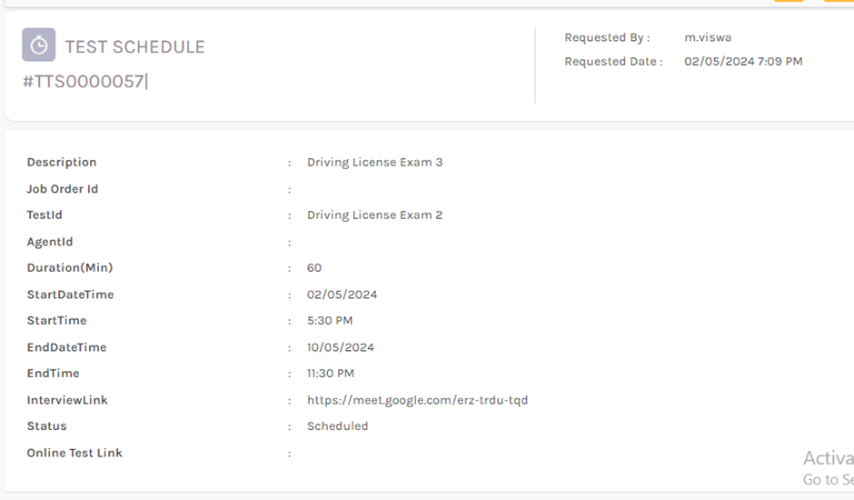

## Candidate Acceptance System - Issues

  *	Online Test > Test > Test Question Create – Test Id is disabled, unable to select manually. But In the Test Question Edit, Test Id is Editable.

  

  

  *	Online Test > Test Schedule > Edit Test Schedule form – There is a “2 Job Order Id” dropdown.

  

  * Online Test > Test Schedule – Online Test link was not generating without selecting the Job Order Id. There is no my selected Test questions in the Job Order Id dropdown.

  

  

  *	Online Test > Test Schedule > Edit Test Schedule – Multiple Job Order Id is Selected.

   

  

  *	Online Test > Test Schedule > Edit Test Schedule – Job Order Id dropdown RecId & Description search not working.

   